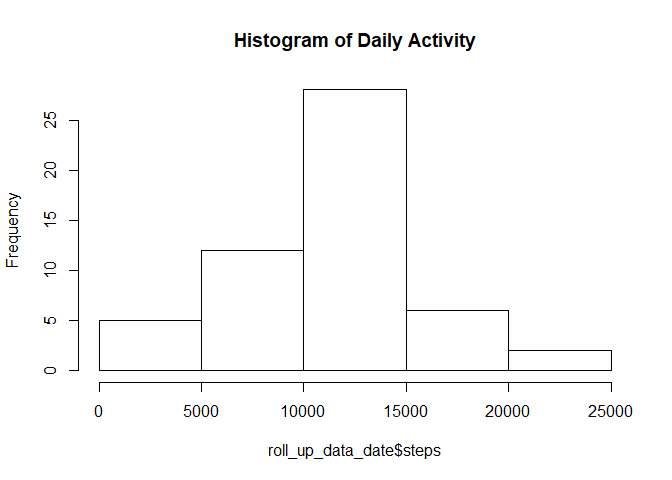
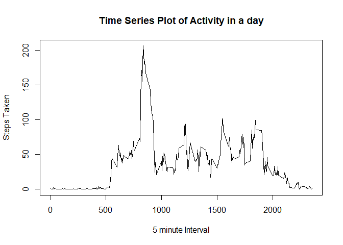
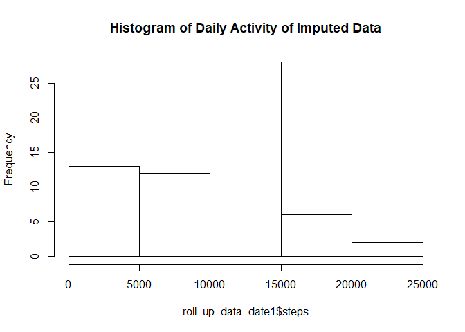
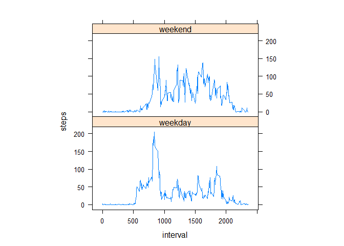

# Reproducible Research: Peer Assessment 1
This document is part of the Reproducible reserach course. It aims to 
showcase the use of R Markdown to create literate Statistical Programming.
The data used is activity data and is downloaded from https://github.com/rdpeng/RepData_PeerAssessment1


## Loading and preprocessing the data
First Load to data into a variable and run summary to get an understanding 
of the data

```r
activity_data<-read.csv("C:/Users/anish/Desktop/Coursera/R_Programming/Reproducibile Research/RepData_PeerAssessment1/activity/activity.csv")
summary(activity_data)
```

```
##      steps                date          interval     
##  Min.   :  0.00   2012-10-01:  288   Min.   :   0.0  
##  1st Qu.:  0.00   2012-10-02:  288   1st Qu.: 588.8  
##  Median :  0.00   2012-10-03:  288   Median :1177.5  
##  Mean   : 37.38   2012-10-04:  288   Mean   :1177.5  
##  3rd Qu.: 12.00   2012-10-05:  288   3rd Qu.:1766.2  
##  Max.   :806.00   2012-10-06:  288   Max.   :2355.0  
##  NA's   :2304     (Other)   :15840
```

## What is mean total number of steps taken per day?
*Roll up the data and ignore the NA cases

```r
roll_up_data_date<-aggregate(steps~date,data=activity_data,sum,na.rm=TRUE)
```
*Create a Histogram and then calculate the mean and median

```r
hist(roll_up_data_date$steps,main="Histogram of Daily Activity")
```

<!-- -->

* Calculate and report the **mean** and **median** total number of steps taken 
per day 


```r
daily_mean<-mean(roll_up_data_date$steps)
daily_med<-median(roll_up_data_date$steps)
```
* The **mean** total number of steps taken per day is 
    1.0766189\times 10^{4} steps.
* The **median** total number of steps taken per day is 
    10765 steps.
    
## What is the average daily activity pattern?
*Create aggregates at the 5 minute intervals and plot the activity in those 
5 minute intervals


```r
roll_up_data_int<-aggregate(steps~interval,data=activity_data,mean,na.rm=TRUE)
plot(roll_up_data_int$interval,roll_up_data_int$steps,type="l",main = "Time Series Plot of Activity in a day",xlab="5 minute Interval",ylab="Steps Taken")
```

<!-- -->
* Calculate which 5 minute interval has the Maximum activity

```r
five_minute_int <- roll_up_data_int[which.max(roll_up_data_int$steps),]$interval
```

The five minute interval with maximum activity is 835

## Imputing missing values
*Calculate and report the total number of missing values in the data

```r
miss_cases<-sum(is.na(activity_data$steps))
```
The total number of missing cases in the raw data are `r miss_cases'
*Create a dataset with missing values filled in. Firstly, I have created a dataset which has the median values of the 5 minute intervals which we will useto impute data later

```r
roll_up_data_int1<-aggregate(steps~interval,data=activity_data,median,na.rm=TRUE)
```
*Now create a copy of the original raw data and iterate through it and repalce the NA values with the median

```r
imputed_act_data<-activity_data
for(i in 1:nrow(imputed_act_data)){
  if(is.na(imputed_act_data[i,]$steps)){
    imputed_act_data[i,]$steps <- roll_up_data_int1[roll_up_data_int1$interval==imputed_act_data[i,]$interval,]$steps
  }
}
```

*Roll up the the new data

```r
roll_up_data_date1<-aggregate(steps~date,data=imputed_act_data,sum,na.rm=TRUE)
```
*Create a Histogram of the new Data

```r
hist(roll_up_data_date1$steps,main="Histogram of Daily Activity of Imputed Data")
```

<!-- -->

* Calculate and report the **mean** and **median** total number of steps taken 
per day of the new data


```r
daily_mean1<-mean(roll_up_data_date1$steps)
daily_med1<-median(roll_up_data_date1$steps)
```
* The **mean** total number of steps taken per day is 
    9503.8688525 steps.
* The **median** total number of steps taken per day is 
    10395 steps.
    
## Are there differences in activity patterns between weekdays and weekends?

* Create a variable called ind_weekday which would be a factor with values weekday and weekend

```r
imputed_act_data$ind_weekday = ifelse(as.POSIXlt(as.Date(imputed_act_data$date))$wday%%6==0,"weekend","weekday")
imputed_act_data$ind_weekday=factor(imputed_act_data$ind_weekday,levels=c("weekday","weekend"))
```

* Make a panel plot containing a time series plot (i.e. type = "l") of the 5-minute interval (x-axis) and the average number of steps taken, averaged across all weekday days or weekend days (y-axis). 

```r
roll_up_data_int2=aggregate(steps~interval+ind_weekday,imputed_act_data,mean)
library(lattice)
xyplot(steps~interval|factor(ind_weekday),data=roll_up_data_int2,aspect=1/2,type="l")
```

<!-- -->
